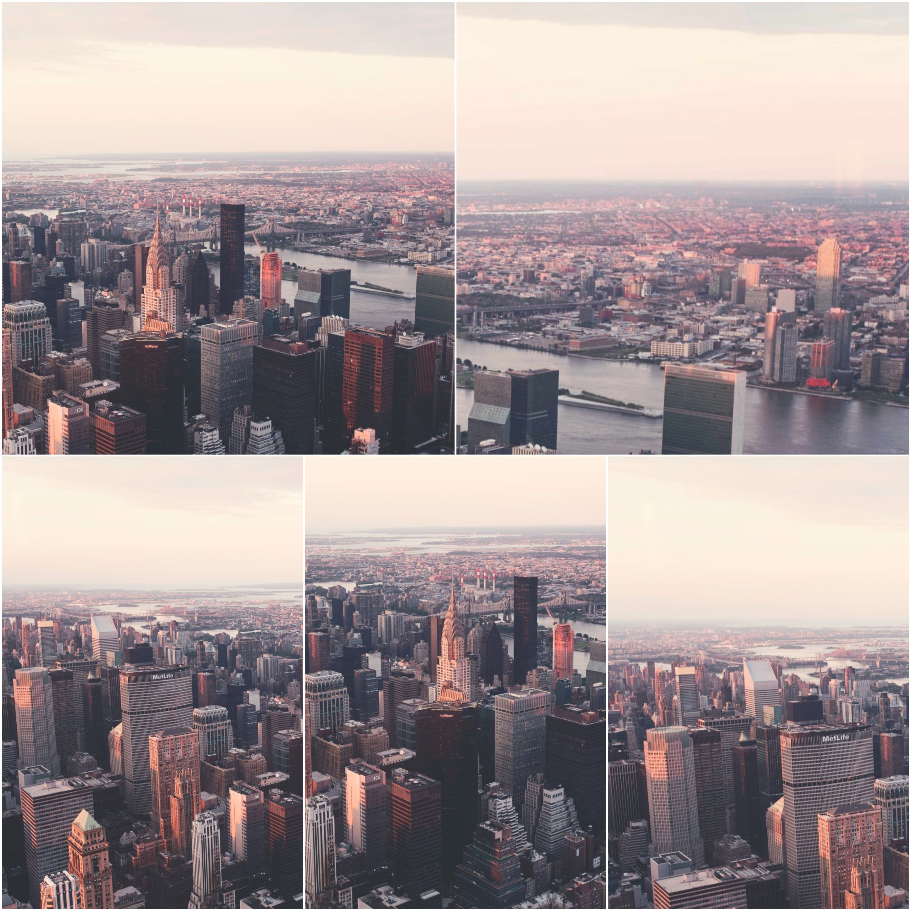
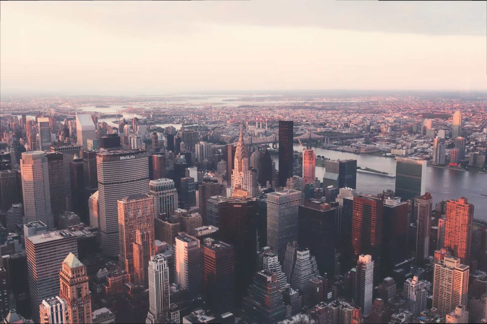

# Aerial Photos Stitching
Given many aerial images of a civil structures at different times, find a mapping function between the images based on some common feature points to align the images and merge them as one.

The code is written in Python using the OpenCV library.

### **Example**
In the first image, you can see several images that comprise the program's input.

The second image shows the program's output, which is the result of stitching all the input images together.

